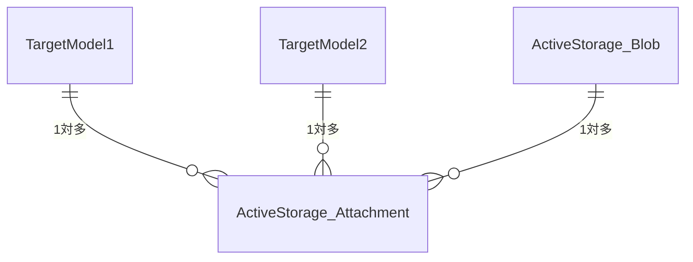

# ActiveStorage の仕組み

## 他の画像アップロード系のgemとの違い
- 一般的なgem --> 対象のモデルにカラムを生やす
- ActiveStorage --> ポリモーフィック関連を選択（どのモデルに紐づけられた画像もAttachmentとBlobを利用）

## ActiveStorage::Blob
- アップロードファイルのメタ情報を管理するモデル

## ActiveStorage::Attachment
- ActiveStorage::Blobと対象モデルとの中間テーブル

## ER図

## モデル
対象モデルに `has_one_attached :カラム名` と記述 --> ActiveStorage::Blobと1対1で関連つける
※複数の画像を紐付けたい時は、`has_many_attached: カラム名(複数形)` とする

## コマンド
### rails active_storage:install
- ActiveStorageのBlobテーブルとAttachmentテーブルとのモデル用のマイグレーションファイルを生成
